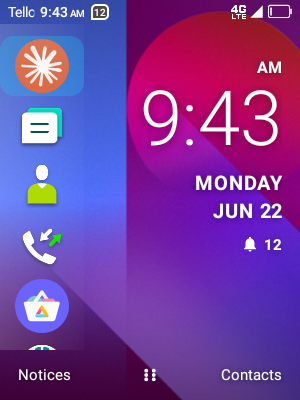
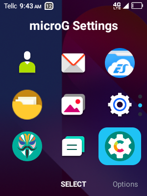
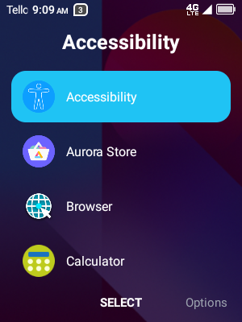
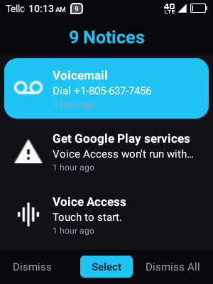
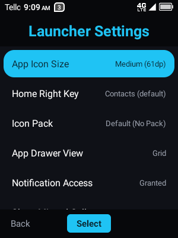
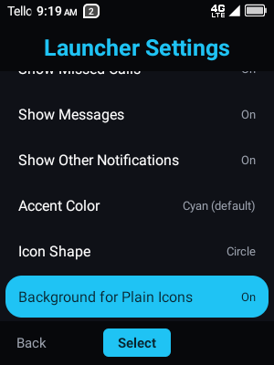

# KaiOS Android Launcher for Flip Phones

A KaiOS-style Android launcher built for feature-phone-shaped devices (small,
low-resolution, D-pad/soft-key driven screens) rather than touch-first
flagships. Navigation leans on the physical soft keys and D-pad: number keys
1-9 double as shortcuts everywhere they make sense, and every screen mirrors
the three-soft-key layout (left / center / right) KaiOS users already know.



## Features

### Home screen

- A vertical rail of up to 9 shortcut icons on the left
- A large clock and date on the right.
- Bottom soft keys: **Notices** (left), **All Apps** (center, tap; long-press
  for **Options**), and a configurable right key (Contacts by default).
- A notification summary (missed calls / messages / other) under the clock,
  each independently toggleable.
- Typing a digit anywhere on Home jumps straight into the dialer, prefilled.
- Long-pressing Back launches a configurable app (Claude, etc.).


### App Drawer ("All Apps")

- Every installed, non-hidden app, in **grid** or **list** view (toggle in
  Launcher Settings):
  - **Grid**: a 3x3 icon page at a time, tracked by a column of dots on the right.
    Number keys 1-9 launch the matching icon on the current page.
  - **List**: one continuous scroll, icon + label per row — no pages, no
    dots, just normal scrolling.
- Long-press (or the Options soft key) on any app to:
  - Add it to Home shortcuts
  - Hide it from the drawer
  - Change its icon (from an installed icon pack or the launcher's own
    bundled icon set)
  - Reset a per-app icon override
  - Uninstall it




### Notices

A custom notification list standing in for the system shade, which isn't
designed for a screen this small. Shows icon, title, body text and a relative
timestamp ("2 minutes ago", "8:30 AM", …) per notification.

- **Dismiss** (left soft key) — dismiss the focused notice
- **Select** (center) — open the notice's action, then dismiss it
- **Dismiss All** (right) — clear every active notification

Requires Notification Access, granted from Launcher Settings.



### Options menu

Reached from Home's center soft key (long-press) or the App Drawer's Options
key:

- All Apps
- Launcher Settings
- Customize Home Shortcuts
- Hide / Show Apps
- Back Button (Long-Press) — assign an app to launch on long-press
- Set Wallpaper
- Set as Default Launcher
- System Settings

### Launcher Settings

- **App Icon Size** — small / medium / large
- **Home Right Key** — assign an app, or leave it as Contacts
- **Icon Pack** — apply any installed icon pack (Nova/ADW/Apex-compatible)
  launcher-wide
- **App Drawer View** — Grid or List
- **Notification Access** — grants/checks the permission that powers Notices
  and the Home badges
- **Show Missed Calls / Messages / Other Notifications** — independent
  toggles for the Home badge summary
- **Accent Color** — cyan (default), red, orange, yellow, green, blue,
  indigo, violet — applied to focus highlights, page dots, and other accents
  throughout the launcher
- **Icon Shape** — squircle, square, rounded square, or circle; adaptive
  icons are masked into the shape, legacy icons get an optional tinted
  background disc
- **Background for Plain Icons** — toggle the synthesized tint disc for
  non-adaptive icons



### Home Shortcuts

Customize the ordered list of up to 9 Home rail shortcuts. Pick a shortcut
row (or its number key) to reassign it, including pinning a specific
*activity* inside an app rather than just its main entry point. The trailing
"Add shortcut" row appends a new one; the Clear soft key removes the focused
shortcut.

### Hide / Show Apps

Lists every installed app with a "Hidden" badge; Center/OK toggles whether
the focused app is hidden from Home and the App Drawer.

### Icon packs & built-in icons

- Apply any installed icon-pack app launcher-wide from Launcher Settings.
- Override a single app's icon independently of the active pack, choosing
  from that pack's full icon set or from the launcher's own bundled icon
  collection — so there's always something to pick from even with no icon
  pack installed.

## Requirements

- Android 5.0 (API 21) or newer
- Kotlin / AGP toolchain — see `build.gradle.kts`

## Building

```bash
./gradlew :app:assembleDebug
```

The debug APK lands in `app/build/outputs/apk/debug/`.

## Installing

```bash
adb install -r app/build/outputs/apk/debug/app-debug.apk
```

Then set Flip Launcher as your default Home app (Options → Set as Default
Launcher), and grant Notification Access from Launcher Settings if you want
the Notices screen and Home notification badges to work.

## Permissions

- `BIND_NOTIFICATION_LISTENER_SERVICE` (via Notification Access, granted by
  the user in system settings) — powers Notices and the Home badge summary.

No other runtime permissions are required. App enumeration uses a `<queries>`
declaration rather than `QUERY_ALL_PACKAGES`.
